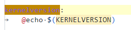
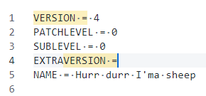
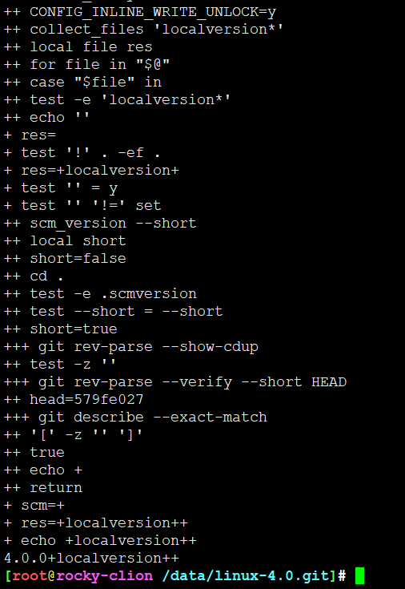
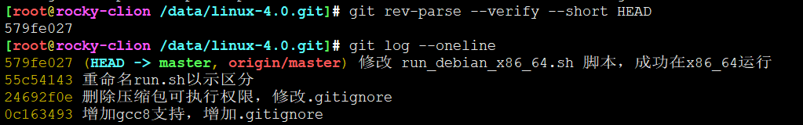
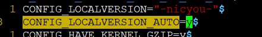

<!-- MDTOC maxdepth:6 firsth1:1 numbering:0 flatten:0 bullets:1 updateOnSave:1 -->

- [内核版本号实现细节](#内核版本号实现细节)   
   - [make kernelversion追踪](#make-kernelversion追踪)   
   - [maek kernelrelease追踪](#maek-kernelrelease追踪)   
      - [解析selocalversion](#解析selocalversion)   
   - [如何传递kernelrelease到内核中](#如何传递kernelrelease到内核中)   

<!-- /MDTOC -->
# 内核版本号实现细节

## make kernelversion追踪



```
KERNELVERSION = $(VERSION)$(if $(PATCHLEVEL),.$(PATCHLEVEL)$(if $(SUBLEVEL),.$(SUBLEVEL)))$(EXTRAVERSION)

->
KERNELVERSION = $(VERSION) \
  $(if \
    $(PATCHLEVEL),.$(PATCHLEVEL)$(if $(SUBLEVEL),.$(SUBLEVEL)) \
    ) \
  $(EXTRAVERSION)
```

此处用到Makefile的if语句

```
$(if CONDITION,THEN-PART)
$(if CONDITION,THEN-PART[,ELSE-PART])
```

* VERSION=4
  - 若PATCHLEVEL不为空，则拼接.PATCHLEVEL
    - 若SUBLEVEL不为空，则拼接.SUBLEVEL




```
VERSION = 4     //主版本号
PATCHLEVEL = 0  //修补版本号
SUBLEVEL = 0    //次版本号
EXTRAVERSION =  //附加信息，一般默认为空，我们可以自己设置
KERNELVERSION = $(VERSION).$(PATCHLEVEL).$(SUBLEVEL).$(EXTRAVERSION)
```


## maek kernelrelease追踪

```
kernelrelease:
	@echo "$(KERNELVERSION)$$($(CONFIG_SHELL) $(srctree)/scripts/setlocalversion $(srctree))"
```

kernelrelease是在KERNELVERSION基础上增加字段


获取当前环境锁用的shell

```
# SHELL used by kbuild
CONFIG_SHELL := $(shell if [ -x "$$BASH" ]; then echo $$BASH; \
	  else if [ -x /bin/bash ]; then echo /bin/bash; \
	  else echo sh; fi ; fi)
```


如果用户没有设置KBUILD_SRC变量，则默认kernel顶层目录作为srctree

```
bash ./scripts/setlocalversion .
```


### 解析selocalversion

```
#!/bin/sh
#
# This scripts adds local version information from the version
# control systems git, mercurial (hg) and subversion (svn).
#
# If something goes wrong, send a mail the kernel build mailinglist
# (see MAINTAINERS) and CC Nico Schottelius
# <nico-linuxsetlocalversion -at- schottelius.org>.
#
#

usage() { # 显示帮助信息
	echo "Usage: $0 [--save-scmversion] [srctree]" >&2
	exit 1
}

scm_only=false
srctree=.
if test "$1" = "--save-scmversion"; then # 如果是  [srctree] [--save-scmversion] 则要炸
	scm_only=true
	shift
fi
if test $# -gt 0; then
	srctree=$1
	shift
fi
if test $# -gt 0 -o ! -d "$srctree"; then
	usage
fi

scm_version()
{
	local short
	short=false

	cd "$srctree"
	if test -e .scmversion; then
		cat .scmversion
		return
	fi
	if test "$1" = "--short"; then
		short=true
	fi

	# Check for git and a git repo.
	if test -z "$(git rev-parse --show-cdup 2>/dev/null)" &&
	   head=`git rev-parse --verify --short HEAD 2>/dev/null`; then

		# If we are at a tagged commit (like "v2.6.30-rc6"), we ignore
		# it, because this version is defined in the top level Makefile.
		if [ -z "`git describe --exact-match 2>/dev/null`" ]; then

			# If only the short version is requested, don't bother
			# running further git commands
			if $short; then
				echo "+"
				return
			fi
			# If we are past a tagged commit (like
			# "v2.6.30-rc5-302-g72357d5"), we pretty print it.
			if atag="`git describe 2>/dev/null`"; then
				echo "$atag" | awk -F- '{printf("-%05d-%s", $(NF-1),$(NF))}'

			# If we don't have a tag at all we print -g{commitish}.
			else
				printf '%s%s' -g $head
			fi
		fi

		# Is this git on svn?
		if git config --get svn-remote.svn.url >/dev/null; then
			printf -- '-svn%s' "`git svn find-rev $head`"
		fi

		# Check for uncommitted changes
		if git diff-index --name-only HEAD | grep -qv "^scripts/package"; then
			printf '%s' -dirty
		fi

		# All done with git
		return
	fi

	# Check for mercurial and a mercurial repo.
	if test -d .hg && hgid=`hg id 2>/dev/null`; then
		# Do we have an tagged version?  If so, latesttagdistance == 1
		if [ "`hg log -r . --template '{latesttagdistance}'`" == "1" ]; then
			id=`hg log -r . --template '{latesttag}'`
			printf '%s%s' -hg "$id"
		else
			tag=`printf '%s' "$hgid" | cut -d' ' -f2`
			if [ -z "$tag" -o "$tag" = tip ]; then
				id=`printf '%s' "$hgid" | sed 's/[+ ].*//'`
				printf '%s%s' -hg "$id"
			fi
		fi

		# Are there uncommitted changes?
		# These are represented by + after the changeset id.
		case "$hgid" in
			*+|*+\ *) printf '%s' -dirty ;;
		esac

		# All done with mercurial
		return
	fi

	# Check for svn and a svn repo.
	if rev=`LANG= LC_ALL= LC_MESSAGES=C svn info 2>/dev/null | grep '^Last Changed Rev'`; then
		rev=`echo $rev | awk '{print $NF}'`
		printf -- '-svn%s' "$rev"

		# All done with svn
		return
	fi
}

collect_files()
{
	local file res

	for file; do
		case "$file" in
		*\~*)
			continue
			;;
		esac
		if test -e "$file"; then
			res="$res$(cat "$file")"
		fi
	done
	echo "$res"
}

if $scm_only; then # 目前用的是gi，不会用到scm_only
	if test ! -e .scmversion; then
		res=$(scm_version)
		echo "$res" >.scmversion
	fi
	exit
fi

if test -e include/config/auto.conf; then
	. include/config/auto.conf  # 基本配置，否则就需要prepare一下
	# 把CONFIG_*作为环境变量
else
	echo "Error: kernelrelease not valid - run 'make prepare' to update it"
	exit 1
fi

# localversion* files in the build and source directory
res="$(collect_files localversion*)"
if test ! "$srctree" -ef .; then
	res="$res$(collect_files "$srctree"/localversion*)"
fi

# CONFIG_LOCALVERSION and LOCALVERSION (if set)
res="${res}${CONFIG_LOCALVERSION}${LOCALVERSION}"

# scm version string if not at a tagged commit
if test "$CONFIG_LOCALVERSION_AUTO" = "y"; then
	# full scm version string
	res="$res$(scm_version)"
else
	# append a plus sign if the repository is not in a clean
	# annotated or signed tagged state (as git describe only
	# looks at signed or annotated tags - git tag -a/-s) and
	# LOCALVERSION= is not specified
	if test "${LOCALVERSION+set}" != "set"; then
		scm=$(scm_version --short)
		res="$res${scm:++}"
	fi
fi

echo "$res" # 输出最终结果
```

忽略大部分，关注这里

```
# CONFIG_LOCALVERSION and LOCALVERSION (if set)
res="${res}${CONFIG_LOCALVERSION}${LOCALVERSION}"

# scm version string if not at a tagged commit
if test "$CONFIG_LOCALVERSION_AUTO" = "y"; then
	# full scm version string
	res="$res$(scm_version)"
else
	# append a plus sign if the repository is not in a clean
	# annotated or signed tagged state (as git describe only
	# looks at signed or annotated tags - git tag -a/-s) and
	# LOCALVERSION= is not specified
	if test "${LOCALVERSION+set}" != "set"; then
		scm=$(scm_version --short)
		res="$res${scm:++}"
	fi
fi

echo "$res"
```

* CONFIG_LOCALVERSION 在 include/config/autoconf 配置
* 建议修改成 CONFIG_LOCALVERSION_AUTO=y 另一种方式花里胡哨，当然你也可以在这里随意定制






一个版本号不应该过于花里胡哨，简单一点，版本+提交号就行了的。稍微改写一下
```
5.4.86-gd9c22b050bd1
```



调整一下，就很棒棒，开森


## 如何传递kernelrelease到内核中


---
