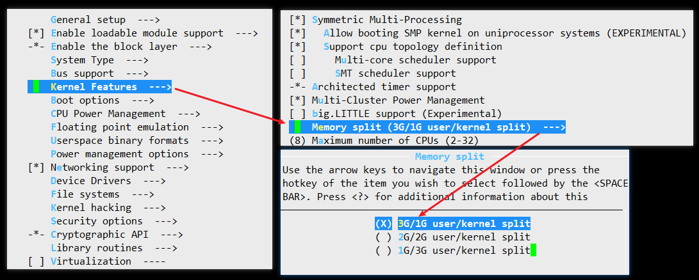

# 32位系统用户空间和内核空间占比3:1可否修改

## arm 32位环境

* ARM Linux配置项 "memory split" 用于调整内核空间、用户空间的大小划分
* 只有三种选择 **1:3 / 2:2 / 3:1**

```
choice
	prompt "Memory split"
	depends on MMU
	default VMSPLIT_3G
	help
	  Select the desired split between kernel and user memory.

	  If you are not absolutely sure what you are doing, leave this
	  option alone!

	config VMSPLIT_3G
		bool "3G/1G user/kernel split"
	config VMSPLIT_2G
		bool "2G/2G user/kernel split"
	config VMSPLIT_1G
		bool "1G/3G user/kernel split"
endchoice

config PAGE_OFFSET
	hex
	default PHYS_OFFSET if !MMU
	default 0x40000000 if VMSPLIT_1G
	default 0x80000000 if VMSPLIT_2G
	default 0xC0000000
```




---
