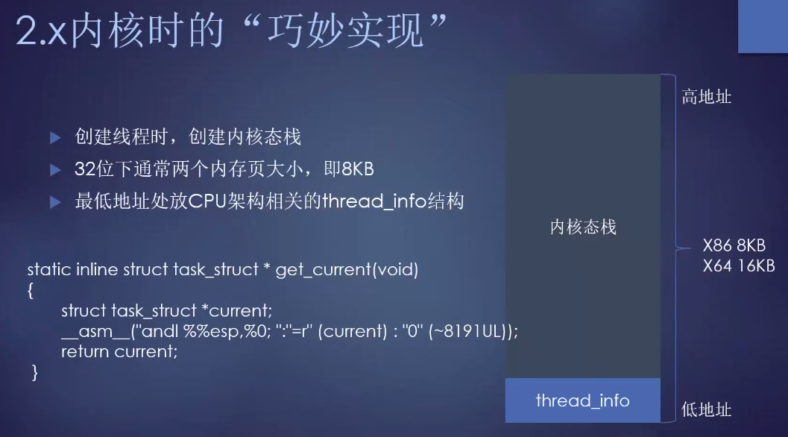

# current在内核中的前前后后

```
所有内容均为学习所用，若有权限要求，请联系清理，谢谢~
```

## 参考

* [张银奎-用调试器深挖Linux内核的霸王代码](https://www.bilibili.com/video/BV1rf4y1f7kM)

---

## 引子


* **函数声明不是一个原型** 错误
* C中规范写法，宏必须大写。但是内核中```current```不该是宏的却是宏而非变量


* 问题抛出，段子先行
* 很多C/C++高手不喜欢用宏


* 早期Linus写的，也确实是变量。


* 96年的时候就变成了宏


* Alan Cox 添加SMP多处理器支持的补丁，但是因为内核有超多current依赖，若要逐一修改不得累死人
* 当时虽然会累死人，现在应该会很要命。所以其实是早期代码遗留问题


## 内核中的进程、线程


* 进程中的mm，同一个进程的mm如果指向相同，则表示相同的地址空间，表示同一个进程，但是不同线程


## PerCPU变量引入


* 每个cpu都应该有一个current，表示当前处理器正在执行的进程
* 毫无疑问，每个CPU应该有一个flag变量，若共用则需要加锁访问，效率不高


* 每个CPU上电就会无脑运行


* 特殊数据区就叫percpu。这个区域有多大？很复杂
* 每个CPU读取自己的percpu变量区域


* 曾经的写法是把pcb信息放到栈中，访问栈的特定位置就能获取到PCB的位置
* 但是栈不安全，容易被安排



* arm是读取特殊区域。arm硬件是安排了percpu区域


* 对于x86, **关键** 每个CPU有自己的gs段
* 所有gs段的内容，都是当前CPU的percpu区域


* X86段机制比较古老，但是在percpu中一直在用


* arm架构。美国人做事不够精细，英国人却能做到
* arm引入了新的机制，叫TPIDR，替代段机制


 


---
