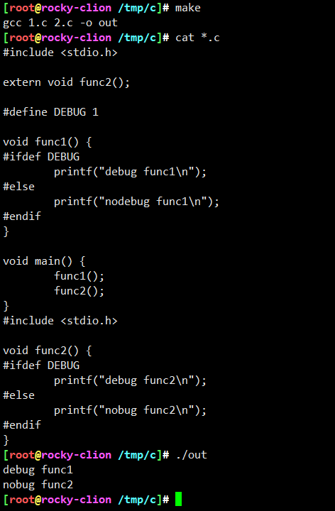

<!-- MDTOC maxdepth:6 firsth1:1 numbering:0 flatten:0 bullets:1 updateOnSave:1 -->

- [内核启动日志](#内核启动日志)   
   - [引子](#引子)   
   - [pr_XXX调用](#pr_xxx调用)   
   - [printk](#printk)   

<!-- /MDTOC -->
# 内核启动日志

## 引子


内核启动日志，输出一大堆，也没见错乱，毫无疑问，内核大佬处理过并发问题，那么具体怎么实现？走你

## pr_XXX调用


两个匹配处


毫无疑问，跟体系架构有关，当前就以arm64位来分析。这里其实也暴露了vscode的一个问题，默认无法根据当前编译.config进行检索。不过还是可以有其它方式，待我摸索透彻记录笔记。


另外，这里定义多处，就很要命了，到底是那个？对新手来说，弃坑的一个理由诞生了


clion + bear 翻车

这种情况，没法直接锚定函数，大概率是个宏，全局检索一下


根据文件名，这个宏也可以体系架构无关的（忽略rootfs_debian_*），那么到底是哪个呢？


vscode检索，总共四个匹配。排除tools，毫无疑问tools不会直接包在内核中，而是除内核镜像的其他二进制。

linux-4.0.git/include/linux/genl_magic_func.h


这个宏什么作用？ 看看网友怎么说 <https://www.orcode.com/question/1183759_k187a7.html>


* 内核中某些头文件只适用于内核，不适用于三方调用头文件者
* 其实就是为了兼容，如果三方库直接用，无异于将完成内核头包进去，而实际可能只是部分
* 那么基于上述思想，这个宏的解释

如果没有定义__KERNEL__，说明三方调库，并且没有其他宏定义过pr_info，那么就定义为fprintf

这个宏是给三方调库使用，而非内核自身所用。因此这里可以排除这个定义点。那么毫无疑问，最后一个就是我们要找的pr_info定义出


linux-4.0.git/include/linux/printk.h


```
/*
 * These can be used to print at the various log levels.
 * All of these will print unconditionally, although note that pr_debug()
 * and other debug macros are compiled out unless either DEBUG is defined
 * or CONFIG_DYNAMIC_DEBUG is set.
 */
#define pr_emerg(fmt, ...) \
	printk(KERN_EMERG pr_fmt(fmt), ##__VA_ARGS__)
#define pr_alert(fmt, ...) \
	printk(KERN_ALERT pr_fmt(fmt), ##__VA_ARGS__)
#define pr_crit(fmt, ...) \
	printk(KERN_CRIT pr_fmt(fmt), ##__VA_ARGS__)
#define pr_err(fmt, ...) \
	printk(KERN_ERR pr_fmt(fmt), ##__VA_ARGS__)
#define pr_warning(fmt, ...) \
	printk(KERN_WARNING pr_fmt(fmt), ##__VA_ARGS__)
#define pr_warn pr_warning
#define pr_notice(fmt, ...) \
	printk(KERN_NOTICE pr_fmt(fmt), ##__VA_ARGS__)
#define pr_info(fmt, ...) \
	printk(KERN_INFO pr_fmt(fmt), ##__VA_ARGS__)
#define pr_cont(fmt, ...) \
	printk(KERN_CONT fmt, ##__VA_ARGS__)

/* pr_devel() should produce zero code unless DEBUG is defined */
#ifdef DEBUG
#define pr_devel(fmt, ...) \
	printk(KERN_DEBUG pr_fmt(fmt), ##__VA_ARGS__)
#else
#define pr_devel(fmt, ...) \
	no_printk(KERN_DEBUG pr_fmt(fmt), ##__VA_ARGS__)
#endif

#include <linux/dynamic_debug.h>

/* If you are writing a driver, please use dev_dbg instead */
#if defined(CONFIG_DYNAMIC_DEBUG)
/* dynamic_pr_debug() uses pr_fmt() internally so we don't need it here */
#define pr_debug(fmt, ...) \
	dynamic_pr_debug(fmt, ##__VA_ARGS__)
#elif defined(DEBUG)
#define pr_debug(fmt, ...) \
	printk(KERN_DEBUG pr_fmt(fmt), ##__VA_ARGS__)
#else
#define pr_debug(fmt, ...) \
	no_printk(KERN_DEBUG pr_fmt(fmt), ##__VA_ARGS__)
#endif

/*
 * Dummy printk for disabled debugging statements to use whilst maintaining
 * gcc's format and side-effect checking.
 */
static inline __printf(1, 2)
int no_printk(const char *fmt, ...)
{
	return 0;
}
```

这里建议参考内核文档 : <https://www.kernel.org/doc/html/latest/core-api/printk-basics.html>
根据优先级定义

* emergency
* alert
* critical
* error
* warnning
* notice
* info
* debug/devel
* ""
* 默认级别
* Continues


* pr_XXX实际是printk的封装，宏定义
* 默认级别就是DEBUG，那么小于DEBUG的等级都会被打印。所以pr_emerg的优先级最高

```
/* pr_devel() should produce zero code unless DEBUG is defined */
#ifdef DEBUG
#define pr_devel(fmt, ...) \
	printk(KERN_DEBUG pr_fmt(fmt), ##__VA_ARGS__)
#else
#define pr_devel(fmt, ...) \
	no_printk(KERN_DEBUG pr_fmt(fmt), ##__VA_ARGS__)
#endif
```

* 这里是个经典的宏用法，如果定义了debug调试模式，那么对应的调试内容会被输出，否则就不会输出
* 在一般c/c++开发中经常用这个开关来配置调试日志，很方便。小技巧


那么这个开关是在哪里定义的？

* 前提需要个基础，就是预编译，其实不同c程序编译前就已经确定了，除非是所有C程序都引用这个定义，才能是全局，否则就是局部。因此各个子功能模块，可以自定义是否开启/关闭DEBUG
* 另外，预编译其实只是简单文本替换，这个本质要把握住




```
For debugging purposes there are also two conditionally-compiled macros: pr_debug() and pr_devel(), which are compiled-out unless DEBUG (or also CONFIG_DYNAMIC_DEBUG in the case of pr_debug()) is defined.
```


* <https://www.kernel.org/doc/html/latest/core-api/printk-basics.html#c.pr_debug>
* 这里说法很明确，DEBUG没法全局，这太过分，因为内核十分庞大，需要DEBUG的c程序，自行安排DEBUG即可


## printk

* 好了，pr_xxx 分析完，接下来就是它实际调用的printk了
* 抛出问题：

1. printk怎么定义滴，怎么处理8个优先级的日志
2. 内核printk的数据流放在哪里？有多大，是不是无限大，会不会满？满了怎么处理

```
#ifndef __KERN_LEVELS_H__
#define __KERN_LEVELS_H__

#define KERN_SOH	"\001"		/* ASCII Start Of Header */
#define KERN_SOH_ASCII	'\001'

#define KERN_EMERG	KERN_SOH "0"	/* system is unusable */
#define KERN_ALERT	KERN_SOH "1"	/* action must be taken immediately */
#define KERN_CRIT	KERN_SOH "2"	/* critical conditions */
#define KERN_ERR	KERN_SOH "3"	/* error conditions */
#define KERN_WARNING	KERN_SOH "4"	/* warning conditions */
#define KERN_NOTICE	KERN_SOH "5"	/* normal but significant condition */
#define KERN_INFO	KERN_SOH "6"	/* informational */
#define KERN_DEBUG	KERN_SOH "7"	/* debug-level messages */

#define KERN_DEFAULT	KERN_SOH "d"	/* the default kernel loglevel */

/*
 * Annotation for a "continued" line of log printout (only done after a
 * line that had no enclosing \n). Only to be used by core/arch code
 * during early bootup (a continued line is not SMP-safe otherwise).
 */
#define KERN_CONT	""

/* integer equivalents of KERN_<LEVEL> */
#define LOGLEVEL_SCHED		-2	/* Deferred messages from sched code
					 * are set to this special level */
#define LOGLEVEL_DEFAULT	-1	/* default (or last) loglevel */
#define LOGLEVEL_EMERG		0	/* system is unusable */
#define LOGLEVEL_ALERT		1	/* action must be taken immediately */
#define LOGLEVEL_CRIT		2	/* critical conditions */
#define LOGLEVEL_ERR		3	/* error conditions */
#define LOGLEVEL_WARNING	4	/* warning conditions */
#define LOGLEVEL_NOTICE		5	/* normal but significant condition */
#define LOGLEVEL_INFO		6	/* informational */
#define LOGLEVEL_DEBUG		7	/* debug-level messages */

#endif
```

八种可用的日志级别字符串：

1. KERN_EMERC 用于紧急事件消息，一般是系统崩溃前的提示信息。
2. KERN_ALERT 用于需要立即采取动作的情况。
3. KERN_CRIT 临界状态，通常涉及严重的硬件或软件操作失败。
4. KERN_ERR 用于报告错误状态。设备驱动程序会经常使用KERN_ERR来报告来自硬件的问题。
5. KERN_WARNING 对可能出现的情况进行警告，但着了情况通常不会对系统造成严重问题。
6. KERN_NOTICE 有必要进行提示的正常情况。许多与安全相关的状况用这个级别进行汇报。
7. KERN_INFO 提示性信息，很多驱动程序在启动的时候以这个级别来打印出它们找到的硬件信息。
8. KERN_DEBUG 用于调试信息

* <https://blog.csdn.net/xuangelouzhu/article/details/118612016>

```
printk (fmt, ...)

print a kernel message

Parameters

fmt
format string

...
variable arguments

Description

This is printk(). It can be called from any context. We want it to work.

If printk indexing is enabled, _printk() is called from printk_index_wrap. Otherwise, printk is simply #defined to _printk.

We try to grab the console_lock. If we succeed, it’s easy - we log the output and call the console drivers. If we fail to get the semaphore, we place the output into the log buffer and return. The current holder of the console_sem will notice the new output in console_unlock(); and will send it to the consoles before releasing the lock.

One effect of this deferred printing is that code which calls printk() and then changes console_loglevel may break. This is because console_loglevel is inspected when the actual printing occurs.
```

来吧，断案开始，如何定位printk定义出，字符创检索得到的三个地方


前两条，其实是为了兼容而设定，printk直接不做任何操作返回，所以，第三条才是printk的真身


linux-4.0.git/kernel/printk/printk.c

```
/**
 * printk - print a kernel message
 * @fmt: format string
 *
 * This is printk(). It can be called from any context. We want it to work.
 *
 * We try to grab the console_lock. If we succeed, it's easy - we log the
 * output and call the console drivers.  If we fail to get the semaphore, we
 * place the output into the log buffer and return. The current holder of
 * the console_sem will notice the new output in console_unlock(); and will
 * send it to the consoles before releasing the lock.
 *
 * One effect of this deferred printing is that code which calls printk() and
 * then changes console_loglevel may break. This is because console_loglevel
 * is inspected when the actual printing occurs.
 *
 * See also:
 * printf(3)
 *
 * See the vsnprintf() documentation for format string extensions over C99.
 */
asmlinkage __visible int printk(const char *fmt, ...)
{
	printk_func_t vprintk_func;
	va_list args;
	int r;

	va_start(args, fmt);

	/*
	 * If a caller overrides the per_cpu printk_func, then it needs
	 * to disable preemption when calling printk(). Otherwise
	 * the printk_func should be set to the default. No need to
	 * disable preemption here.
	 */
	vprintk_func = this_cpu_read(printk_func);
	r = vprintk_func(fmt, args);

	va_end(args);

	return r;
}
EXPORT_SYMBOL(printk);


/*
 * This allows printk to be diverted to another function per cpu.
 * This is useful for calling printk functions from within NMI
 * without worrying about race conditions that can lock up the
 * box.
 */
DEFINE_PER_CPU(printk_func_t, printk_func) = vprintk_default;

int vprintk_default(const char *fmt, va_list args)
{
	int r;

#ifdef CONFIG_KGDB_KDB
	if (unlikely(kdb_trap_printk)) {
		r = vkdb_printf(KDB_MSGSRC_PRINTK, fmt, args);
		return r;
	}
#endif
	r = vprintk_emit(0, LOGLEVEL_DEFAULT, NULL, 0, fmt, args);

	return r;
}
EXPORT_SYMBOL_GPL(vprintk_default);

```

* 著名的printk函数，核心调用的是vprintk_emit()
* <https://blog.csdn.net/guodongping/article/details/9822935>


 


---
