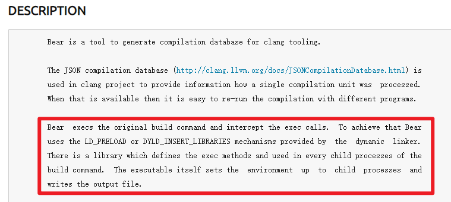
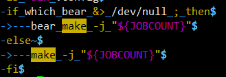
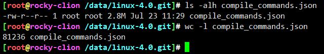

# 如何获取内核编译细节

## 引入

* 内核编译虽然是KCONFIG、make一系列，并发编译，但实际上与并发执行一个道理，肯定可以细化到原子编译，并且可以串行编译。so，如果捕获这些细节？
* 换句话说，父进程执行make命令，如何捕获所有子进程的"程序名称+参数"

## 参考例子bear

* <https://manpages.ubuntu.com/manpages/xenial/man1/bear.1.html>



* bear代码分析笔记：<https://github.com/yifengyou/bear-2.4.4>



使用bear捕获make工具的所有编译命令



样例输出：

```
[
    {
        "arguments": [
            "aarch64-linux-gnu-gcc",
            "-c",
            "-Wp,-MD,kernel/irq/.msi.o.d",
            "-nostdinc",
            "-isystem",
            "/data/gcc-linaro-11.3.1-2022.06-x86_64_aarch64-linux-gnu/bin/../lib/gcc/aarch64-linux-gnu/11.3.1/include",
            "-I./arch/arm64/include",
            "-Iarch/arm64/include/generated/uapi",
            "-Iarch/arm64/include/generated",
            "-Iinclude",
            "-I./arch/arm64/include/uapi",
            "-Iarch/arm64/include/generated/uapi",
            "-I./include/uapi",
            "-Iinclude/generated/uapi",
            "-include",
            "./include/linux/kconfig.h",
            "-D__KERNEL__",
            "-mlittle-endian",
            "-Wall",
            "-Wundef",
            "-Wstrict-prototypes",
            "-Wno-trigraphs",
            "-fno-strict-aliasing",
            "-fno-common",
            "-Werror-implicit-function-declaration",
            "-Wno-format-security",
            "-std=gnu89",
            "-fno-pie",
            "-Wno-attributes",
            "-mgeneral-regs-only",
            "-fno-delete-null-pointer-checks",
            "-O0",
            "-Wframe-larger-than=4096",
            "-fno-stack-protector",
            "-Wno-unused-but-set-variable",
            "-fno-omit-frame-pointer",
            "-fno-optimize-sibling-calls",
            "-fno-var-tracking-assignments",
            "-g",
            "-pg",
            "-Wdeclaration-after-statement",
            "-Wno-pointer-sign",
            "-fno-strict-overflow",
            "-fconserve-stack",
            "-Werror=implicit-int",
            "-Werror=strict-prototypes",
            "-Werror=date-time",
            "-DCC_HAVE_ASM_GOTO",
            "-DKBUILD_STR(s)=#s",
            "-DKBUILD_BASENAME=KBUILD_STR(msi)",
            "-DKBUILD_MODNAME=KBUILD_STR(msi)",
            "-o",
            "kernel/irq/.tmp_msi.o",
            "kernel/irq/msi.c"
        ],
        "directory": "/data/linux-4.0.git",
        "file": "kernel/irq/msi.c"
    },{

    }
    .....
]
```

bear设计，上层是python处理数据，底层用到了LD_PRELOAD机制。具体设计查看bear的学习笔记。

## ebpf捕获make工具的所有子命令

* 首先，make命令可定是作为编译的祖先进程，但是子命令可能是子孙的N代
* ebpf可以捕获所有进程祖先关系，因此我们需要锚定make命令作为祖先的所有子进程/子线程，因此进程树关系要找到，然后问题就变成，进程树中找共有的祖先问题
* ebpf获取进程的详细信息，struct task_strcut 数据都能get到
* 实现，走你


---
