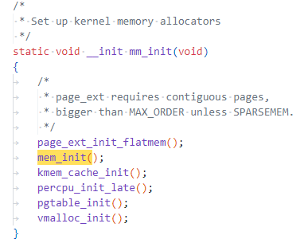
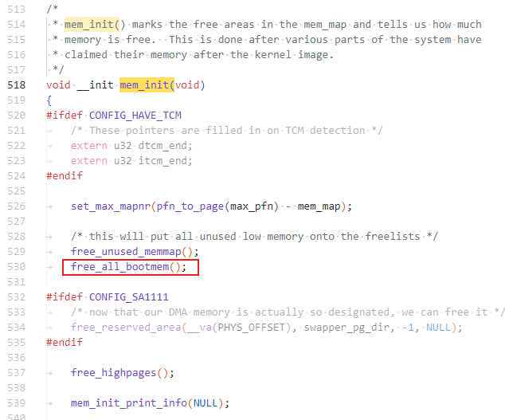
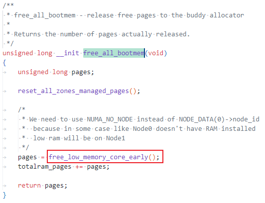
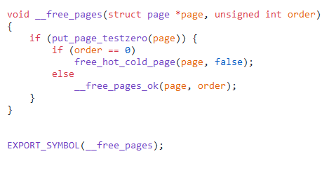
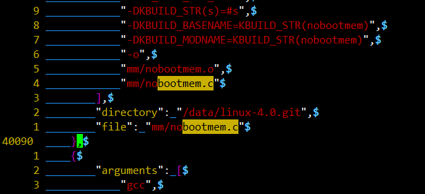
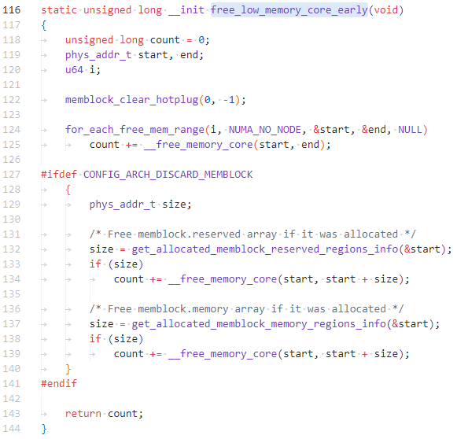
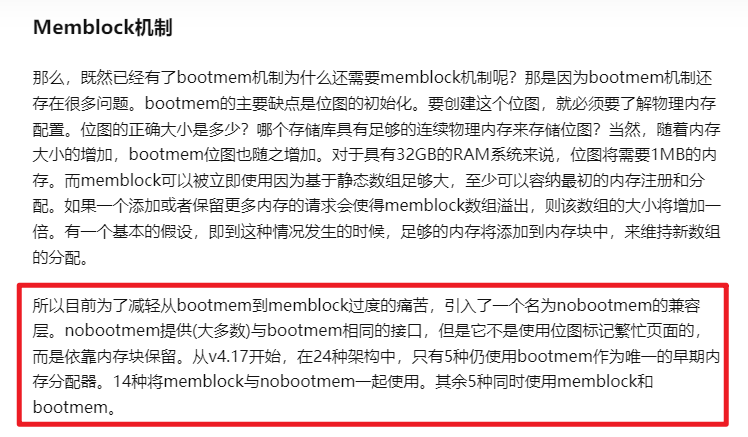
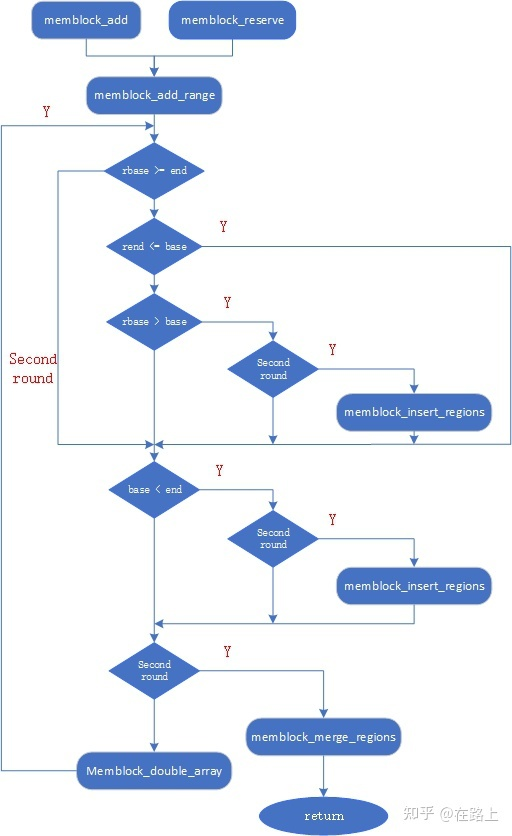

# 物理页面如何添加到伙伴系统


```
asmlinkage __visible void __init start_kernel(void)
{
  ...
  setup_log_buf(0);
	pidhash_init();
	vfs_caches_init_early();
	sort_main_extable();
	trap_init();
	mm_init();
  ...
}
```






mm/nobootmem.c



为什么还有一个一毛一样函数声明的 ```free_all_bootmem(void)```

mm/bootmem.c



bear大杀器搞起，检索到压根就没有编译bootmem.c





具体原因：



```
/**
 * for_each_free_mem_range - iterate through free memblock areas
 * @i: u64 used as loop variable
 * @nid: node selector, %NUMA_NO_NODE for all nodes
 * @p_start: ptr to phys_addr_t for start address of the range, can be %NULL
 * @p_end: ptr to phys_addr_t for end address of the range, can be %NULL
 * @p_nid: ptr to int for nid of the range, can be %NULL
 *
 * Walks over free (memory && !reserved) areas of memblock.  Available as
 * soon as memblock is initialized.
 */
#define for_each_free_mem_range(i, nid, p_start, p_end, p_nid)		\
	for_each_mem_range(i, &memblock.memory, &memblock.reserved,	\
			   nid, p_start, p_end, p_nid)
```


```
/**
 * for_each_mem_range - iterate through memblock areas from type_a and not
 * included in type_b. Or just type_a if type_b is NULL.
 * @i: u64 used as loop variable
 * @type_a: ptr to memblock_type to iterate
 * @type_b: ptr to memblock_type which excludes from the iteration
 * @nid: node selector, %NUMA_NO_NODE for all nodes
 * @p_start: ptr to phys_addr_t for start address of the range, can be %NULL
 * @p_end: ptr to phys_addr_t for end address of the range, can be %NULL
 * @p_nid: ptr to int for nid of the range, can be %NULL
 */
#define for_each_mem_range(i, type_a, type_b, nid,			\
			   p_start, p_end, p_nid)			\
	for (i = 0, __next_mem_range(&i, nid, type_a, type_b,		\
				     p_start, p_end, p_nid);		\
	     i != (u64)ULLONG_MAX;					\
	     __next_mem_range(&i, nid, type_a, type_b,			\
			      p_start, p_end, p_nid))
```


## memblock机制

* <https://zhuanlan.zhihu.com/p/523699107>
* <https://richardweiyang-2.gitbook.io/kernel-exploring/00-memory_a_bottom_up_view/06-page_alloc>
* <https://richardweiyang-2.gitbook.io/kernel-exploring/00-memory_a_bottom_up_view/02-memblock>

```
BIOS -> e820 -> memblock -> Buddy
```

```
    start_kernel()
        mm_init()
            mem_init()
                memblock_free_all()
                    free_low_memory_core_early()
                        ...
                        __free_pages_core()
```

 

## bootmem机制

* <https://zhuanlan.zhihu.com/p/355035376#:~:text=bootmem%E6%98%AF%E5%9F%BA%E4%BA%8E%E9%A6%96%E6%AC%A1%E9%80%82%E5%BA%94,%2F4096%2F8%3D128KB%E3%80%82>
* bootmem是启动时物理内存的分配器和配置器，在还没有构建完整的页分配机制（page allocator）之前，可以用来实现简单的内存分配和释放操作，之后完整的内存管理系统也是基于bootmem构建的。


---
