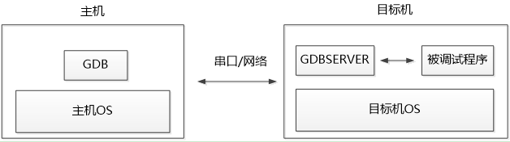
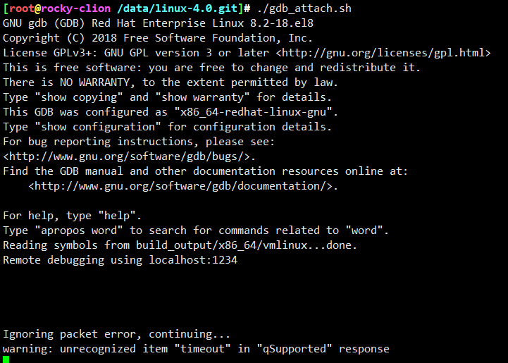

<!-- MDTOC maxdepth:6 firsth1:1 numbering:0 flatten:0 bullets:1 updateOnSave:1 -->

- [qemu内置gdb调试](#qemu内置gdb调试)   
   - [int 3 调试原理](#int-3-调试原理)   
   - [qemu内置gdbserver原理](#qemu内置gdbserver原理)   
   - [qemu 7.0 gdb相关文件](#qemu-70-gdb相关文件)   
   - [qemu gdbserver仅支持一个客户端连接](#qemu-gdbserver仅支持一个客户端连接)   

<!-- /MDTOC -->

# qemu内置gdb调试

## int 3 调试原理


## qemu内置gdbserver原理

* <https://zhuanlan.zhihu.com/p/518849278>

* gdb设置断点的原理是使用ptrace系统调用建立gdb与目标程序的调试关系，gdb因此能够控制目标程序并先行对信号进行处理。
* 因此设置断点的原理是：在断点处插入int 3触发软中断，gdb先行受到该软中断发出的SIGTRAP信号，从而转入gdb命令行，被调试程序停止。

利用gdb远程连接到和qemu中的gdbserver可以调试linux内核的执行过程。

那qemu内的gdbserver是如何触发断点让程序停止的？

如果也是使用int 3中断，那如果qemu已经是处在被gdb调试的状态(即gdb qemu -S -s [...])则如何区分int 3是来自gdb调qemu的还是qemu内gdbserver调内核的？如果qemu内部gdbserver利用硬件来触发断点，那有些虚拟机不存在此类硬件又该如何处置？

它既不是利用int 3中断，也不是利用特殊的硬件支持，而是将断点target block翻译成”调用helper_debuge“退出cpu循环，再利用qemu的线程间通信(通过一些全局变量判断状态等)，通知到gdbserver的处理函数。

简单的说，cpu_exec执行到”断点代码”后停止，检测cpu退出原因，调用相应的异常/中断处理函数。如这里是触发断点，cpu退出后，在switch case到EXCP_DEBUG执行cpu_handle_guest_debug，修改debug_requested全局变量。主循环检测到debug_requested会触发vm_stop改变虚拟机状态。

* <https://www.cnblogs.com/ccxikka/p/10519518.html>



* 在GDB/GDBSERVER调试模型中，GDBSERVER是一个轻量级的GDB调试器，在调试过程中担任着调试代理的角色。
* 在调试过程中，主机和目标机之间使用串口或者网络作为通信的通道。
* 在主机上GDB通过这条通道使用一种基于ASCII的简单通讯协议RSP与在目标机上运行的GDBSERVER进行通讯。
* GDB发送指令，如内存、寄存器读写，GDBSERVER则首先与运行被调试程序映像的进程进行绑定，然后等待GDB发来的数据，对包含命令的数据包进行解析之后便进行相关处理，然后将结果返回给主机上的GDB。
* RSP协议将GDB/GDBSERVER间通讯的内容更看做是数据包，数据包的内容都使用ASCII字符。每一个数据包都遵循这样的格式：```$ <调试信息>#<校验码>```

## gdb调试技巧

* <https://visualgdb.com/gdbreference/commands/>
* <https://wizardforcel.gitbooks.io/100-gdb-tips/content/set-print-pretty-on.html>


## qemu 7.0 gdb相关文件

```
[root@rocky-clion /data/qemu-7.0.0.git/BUILD/qemu-7.0.0]# find ./ -name "*gdb*"
./gdb-xml
./roms/ipxe/src/hci/commands/gdbstub_cmd.c
./roms/ipxe/src/core/gdbserial.c
./roms/ipxe/src/core/gdbstub.c
./roms/ipxe/src/core/gdbudp.c
./roms/ipxe/src/include/ipxe/gdbstub.h
./roms/ipxe/src/include/ipxe/gdbudp.h
./roms/ipxe/src/include/ipxe/gdbserial.h
./roms/ipxe/src/arch/x86_64/core/gdbidt.S
./roms/ipxe/src/arch/x86_64/include/gdbmach.h
./roms/ipxe/src/arch/x86/core/gdbmach.c
./roms/ipxe/src/arch/arm64/include/gdbmach.h
./roms/ipxe/src/arch/arm32/include/gdbmach.h
./roms/ipxe/src/arch/i386/core/gdbidt.S
./roms/ipxe/src/arch/i386/tests/gdbstub_test.S
./roms/ipxe/src/arch/i386/tests/gdbstub_test.gdb
./roms/ipxe/src/arch/i386/include/gdbmach.h
./roms/u-boot-sam460ex/tools/gdb
./roms/u-boot-sam460ex/tools/gdb/gdbcont.c
./roms/u-boot-sam460ex/tools/gdb/gdbsend.c
./roms/u-boot-sam460ex/include/kgdb.h
./roms/u-boot-sam460ex/arch/blackfin/lib/kgdb.c
./roms/u-boot-sam460ex/arch/blackfin/lib/__kgdb.S
./roms/u-boot-sam460ex/arch/blackfin/lib/kgdb.h
./roms/u-boot-sam460ex/arch/powerpc/lib/kgdb.c
./roms/u-boot-sam460ex/arch/powerpc/cpu/mpc8260/kgdb.S
./roms/u-boot-sam460ex/arch/powerpc/cpu/74xx_7xx/kgdb.S
./roms/u-boot-sam460ex/arch/powerpc/cpu/mpc8xx/kgdb.S
./roms/u-boot-sam460ex/arch/powerpc/cpu/ppc4xx/kgdb.S
./roms/u-boot-sam460ex/common/kgdb.c
./roms/u-boot-sam460ex/common/kgdb_stubs.c
./roms/u-boot/tools/gdb
./roms/u-boot/tools/gdb/gdbcont.c
./roms/u-boot/tools/gdb/gdbsend.c
./roms/u-boot/include/kgdb.h
./roms/u-boot/arch/powerpc/lib/kgdb.c
./roms/u-boot/common/kgdb.c
./roms/u-boot/common/kgdb_stubs.c
./roms/u-boot/board/cobra5272/bdm/gdbinit.reset
./roms/u-boot/board/cobra5272/bdm/cobra5272_uboot.gdb
./roms/skiboot/libstb/crypto/mbedtls/tests/scripts/test_zeroize.gdb
./roms/edk2/EmulatorPkg/Unix/.gdbinit
./stubs/gdbstub.c
./hw/rx/rx-gdbsim.c
./gdbstub.c
./tests/tcg/aarch64/gdbstub
./tests/tcg/cris/.gdbinit
./tests/tcg/multiarch/gdbstub
./tests/tcg/s390x/gdbstub
./tests/guest-debug/test-gdbstub.py
./tests/avocado/machine_rx_gdbsim.py
./meson/test cases/frameworks/7 gnome/gdbus
./meson/test cases/frameworks/7 gnome/gdbus/gdbusprog.c
./include/exec/gdbstub.h
./.gdbinit
./scripts/qemugdb
./scripts/qemu-gdb.py
./docs/system/gdb.rst
./target/ppc/gdbstub.c
./target/avr/gdbstub.c
./target/riscv/gdbstub.c
./target/xtensa/core-test_kc705_be/gdb-config.c.inc
./target/xtensa/core-de212/gdb-config.c.inc
./target/xtensa/gdbstub.c
./target/xtensa/core-test_mmuhifi_c3/gdb-config.c.inc
./target/xtensa/core-sample_controller/gdb-config.c.inc
./target/xtensa/core-dc233c/gdb-config.c.inc
./target/xtensa/core-de233_fpu/gdb-config.c.inc
./target/xtensa/core-dc232b/gdb-config.c.inc
./target/xtensa/core-dsp3400/gdb-config.c.inc
./target/mips/gdbstub.c
./target/alpha/gdbstub.c
./target/microblaze/gdbstub.c
./target/cris/gdbstub.c
./target/openrisc/gdbstub.c
./target/hexagon/gdbstub.c
./target/sh4/gdbstub.c
./target/m68k/gdbstub.c
./target/tricore/gdbstub.c
./target/rx/gdbstub.c
./target/sparc/gdbstub.c
./target/arm/gdbstub64.c
./target/arm/gdbstub.c
./target/hppa/gdbstub.c
./target/s390x/gdbstub.c
./target/i386/gdbstub.c
```

## qemu gdbserver仅支持一个客户端连接

另一个客户端连接会出现超时




---
