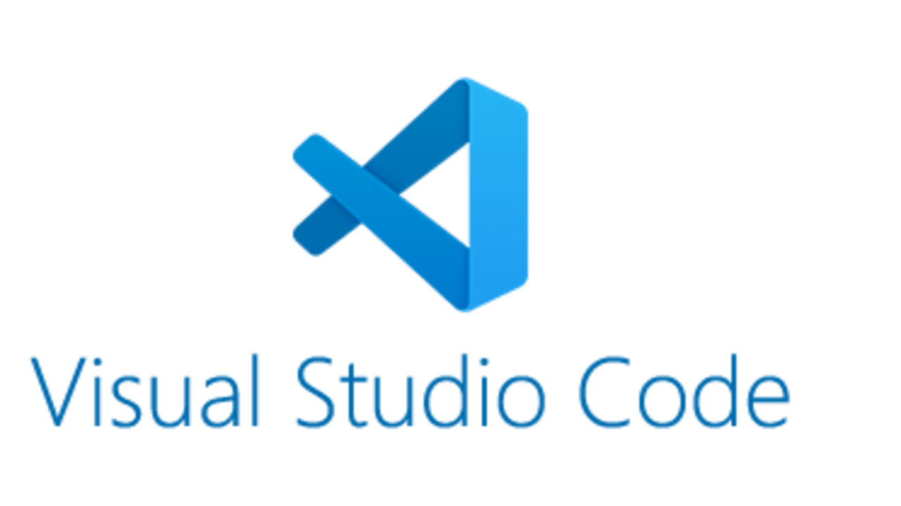
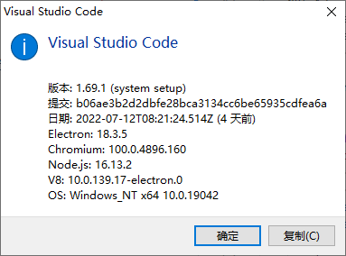
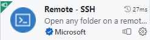
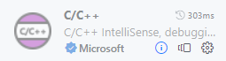
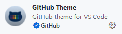
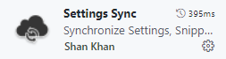
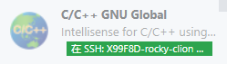
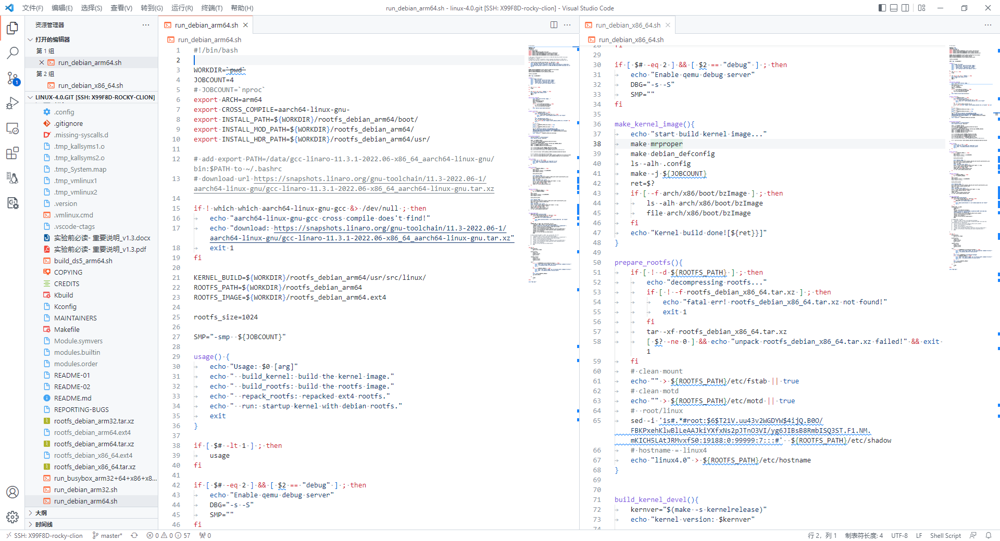
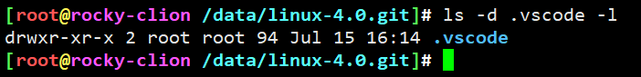

# vscode远程开发

* vim是否落伍，自行体会。这就跟"php是最好的语言"一样，解不开的梗。
* 简单说，没有最好，只有最适合。
* 不建议用vi/vim，力荐vscode
* 更多内容可以参看另一个仓库:<https://github.com/yifengyou/vscode.git>

## 基本部署

* win端vscode安装，路过N次"一路回车"
* mac表示从未拥有过，自行把握

不可少的plugin：

一股github风格的vscode。个人习惯白色高亮。黑色系主题容易犯困。玩的开心就好，自行配置

其他插件，自行玩耍安装。教你做事？

## VScode远程开发配置

使用 Remote SSH 插件，公私钥免密登陆方式，不得用密码，该插件不支持"记住密码"

参看：<https://github.com/yifengyou/vscode#remote-ssh

目标目录会建立.vscode运行时文件，建议放到.gitignore中

---
